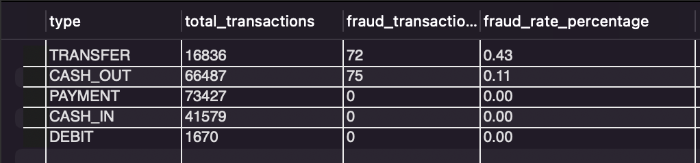
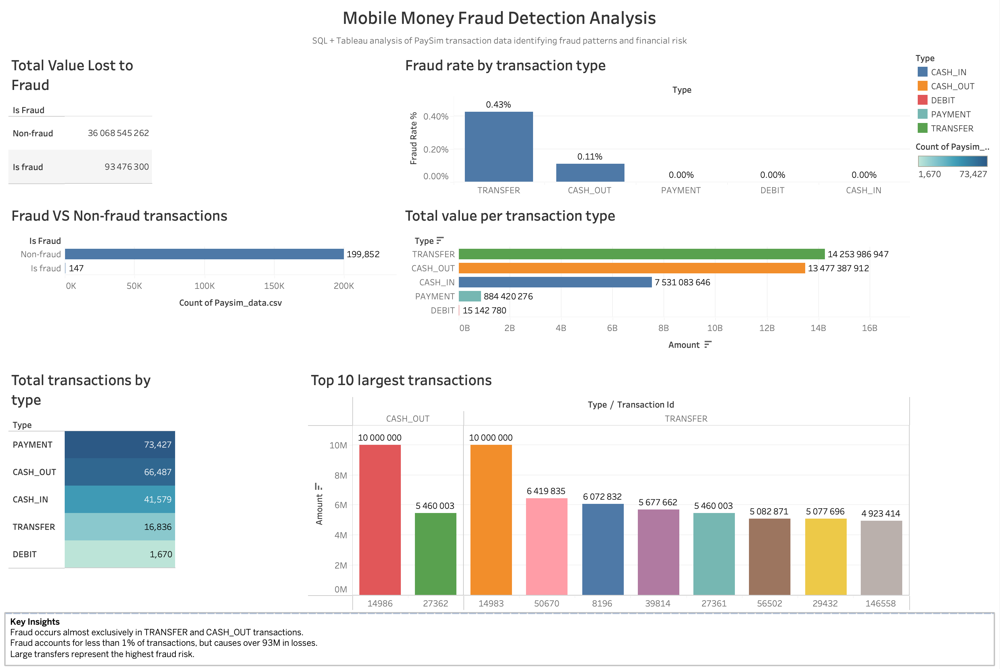

# Mobile Money Transaction & Fraud Analysis (PaySim Dataset)

## Project Overview
This project analyzes mobile money transactions to understand transaction behavior, identify fraud patterns, and provide recommendations for improving fraud detection systems.

The analysis was conducted using SQL for data exploration and fraud detection, and Tableau to visualize transaction behavior and highlight key insights through an interactive dashboard.

## Objectives
The goal of this analysis was to:

- Understand overall transaction activity
- Identify which transaction types are most common
- Determine which transaction types move the most money
- Detect fraud patterns within the system
- Identify high-risk accounts and suspicious activity
- Provide business recommendations to reduce fraud risk

## Dataset
Dataset used: PaySim Mobile Money Transactions**

The dataset simulates real mobile financial transactions and contains:

- 199,999 transactions
- Transaction types (payment, transfer, cash in, cash out, debit)
- Transaction amounts
- Sender and receiver accounts
- Fraud indicators

Key fields include:

- `type`
- `amount`
- `nameOrig`
- `nameDest`
- `isFraud`

## Tools Used

- SQL
- MySQL
- Tableau
- GitHub

## Key Insights

### Transaction Activity
- Total transactions: 199,999
- Total transaction value: R36,162,021,561.57
- Average transaction value: R180,811
- Largest transaction: R10,000,000

### Transaction Behavior
Most common transaction types:

1. Payment
2. Cash Out
3. Cash In
4. Transfer
5. Debit

Although payments occur most frequently, transfers move the largest amount of money.

### Fraud Analysis
Fraud was found in only two transaction types:

- Transfer
- Cash Out

Fraud rates:

- Transfer: 0.43%
- Cash Out: 0.11%

## Example Analysis Output

Below is a preview of the fraud analysis results from the SQL queries.

Total financial loss due to fraud:

R93,476,299.99

Average fraud transaction:

R635,893

### User Activity
The analysis identified:

- Top accounts sending the most money
- Top accounts receiving the most money
- 147 accounts involved in fraudulent transactions**

These accounts represent a small portion of users but account for significant risk.

## Business Recommendations

Based on the analysis, the following actions are recommended:

### Strengthen Monitoring for Transfers
Transfers move the largest amounts of money and have the highest fraud rate. Implement real-time monitoring and additional verification for high-value transfers.

### Monitor Cash-Out Transactions
Cash-out transactions are commonly used by fraudsters to withdraw stolen funds. Introduce withdrawal limits and additional identity verification for large cash-out transactions.

### Implement High-Value Transaction Alerts
Transactions above a defined threshold (e.g., R500,000) should trigger automated alerts for review.

### Monitor High-Activity Accounts
Accounts that send or receive unusually large volumes of money should be flagged for monitoring.

### Improve Fraud Detection Systems
Financial institutions should consider advanced fraud detection systems such as machine learning models and behavioral anomaly detection.

## SQL Analysis

The full SQL queries used in this analysis can be found here:

[view SQL Analysis](sql/paysim_analysis.sql)

These queries cover:

- Data preparation
- Transaction overview
- Transaction behavior analysis
- Fraud risk analysis
- User activity analysis

## Fraud Analysis Dashboard

After performing the SQL queries to analyze PaySim transactions and identify fraudulent behavior, I created an interactive Tableau dashboard to visualize key insights:

- Total transactions by type  
- Fraudulent vs non-fraudulent transactions  
- Fraud rate and top fraud cases  

## PaySim Fraud Analysis Dashboard

Explore the interactive dashboard here: [View on Tableau Public](https://public.tableau.com/views/FintechFraudDetectionDashboardSQLTableauProject/Dashboard1)

## Conclusion

While fraudulent transactions represent a small percentage of total activity, they result in significant financial losses. Fraud is concentrated in transfer and cash-out transactions, indicating the need for stronger monitoring of these transaction types.

By implementing improved transaction monitoring and fraud detection systems, financial platforms can significantly reduce financial risk.
